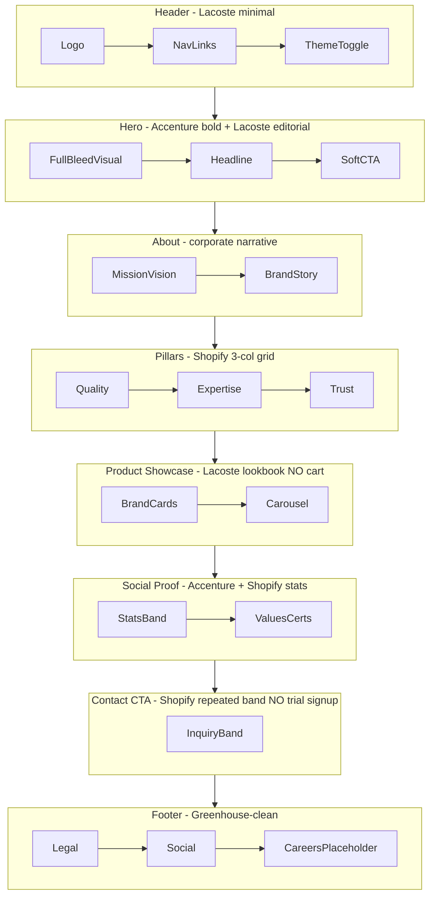

# KGOLD Beauty Essentials — Industry-Standard Landing Page Plan

## Context

- Repo `landingpage-kgold` is **empty** (Git only) — full greenfield build.
- **Primary goal:** Brand awareness (story, values, visual identity) — not lead-gen-first, not e-commerce.
- **Exclude from v1:** Careers section, job listings UI, shopping cart, product checkout.
- **Include later (stub only):** Careers endpoint wiring via env var; footer text link placeholder.
- **Existing brand tokens** to reuse from `questionnaire/frontend/src/index.css`:

| Token | Light | Dark |
|-------|-------|------|
| Background | `#FAFAFA` | `#1C1C1C` |
| Foreground | `#1C1C1C` | `#EDEDED` |
| Primary (gold) | `#C5A028` | `#E5B82E` |
| Gold hover | `#AD8C22` | `#D4A822` |
| Muted gold accent | `#FBF5E6` / `#FEF8E8` | `#2C2618` |

---

## Tech Stack Recommendation

**Recommended: Vite + React 19 + TypeScript + Tailwind CSS v4 (standalone repo)**

Why this over monorepo or Next.js for v1:

| Factor | Decision |
|--------|----------|
| Team familiarity | Matches `questionnaire/frontend` exactly |
| Scope | Single-page marketing site — no app routing complexity |
| Speed to ship | Copy brand CSS vars + logo constants; no monorepo wiring |
| SEO (brand awareness) | Add `vite-plugin-prerender` + semantic HTML + `sitemap.xml` / `robots.txt` / Open Graph meta |
| Deploy | Static `dist/` → Vercel, Cloudflare Pages, or Netlify |

**Future option:** Migrate into `monorepo_kgold` as `apps/landing-web` and adopt `@kgold/ui` once the page stabilizes.

---

## Reference Site → KGOLD Adaptation Map

Non-e-commerce beauty brand = **Accenture structure** + **Shopify conversion rhythm** + **Lacoste visual tone**.



### What we take from each reference

| Source | Pattern | KGOLD adaptation |
|--------|---------|------------------|
| **Accenture** | Full-width hero headline, card carousel, stats/impact band, news-style cards, awards/recognition | Hero + editorial carousel for brand stories; impact stats (years, products, partners); optional "In the spotlight" cards |
| **Shopify** | Repeated CTA bands, 3–4 column benefit grid, big-number stats, FAQ accordion, social proof strip | Benefit pillars grid, stats band, FAQ about the brand (not "how to start a store"), bottom inquiry CTA — **no email trial signup** |
| **Lacoste** | Premium whitespace, editorial imagery, minimal nav, lifestyle-first | Large imagery, restrained typography, gold as accent only (not overwhelming) |
| **Greenhouse** | Clean typography, scannable layout | Footer careers link style only — **no job board on landing page** |

---

## Page Sections (v1)

### 1. Header (sticky)
- Logo + wordmark: **KGOLD Beauty Essentials**
- Nav anchors: About · Our Brands · Quality · Contact
- Light/dark theme toggle (persist via `localStorage`, respect `prefers-color-scheme`)
- Mobile drawer menu

### 2. Hero
- Full-viewport editorial image/video placeholder
- Headline example: *"Beauty essentials, crafted with purpose."*
- Subhead: 1–2 lines on brand promise
- Soft CTA: scroll to About (`#about`) — not "Buy now"

### 3. About / Brand Story (`#about`)
- Mission, vision, short company narrative
- Split layout: copy left, image right (Accenture editorial feel)
- Gold accent rule/divider between sections

### 4. Brand Pillars (`#pillars`)
- 3–4 cards (Shopify grid): e.g. *Quality Formulations · Filipino Expertise · Trusted Partners · Sustainable Care*
- Icon + title + short description per card

### 5. Our Brands / Product Showcase (`#brands`)
- Visual lookbook carousel (Accenture carousel pattern)
- Product/brand cards with image + name + tagline
- **No price, no Add to Cart** — optional "Learn more" scroll or external link placeholder
- Lacoste-style large imagery, subtle hover

### 6. Impact / Stats Band
- 3–4 big numbers (Shopify `$1.1T` style adapted): e.g. years operating, SKUs, partner stores, regions served
- Placeholder values until real data is provided

### 7. Quality & Values (`#quality`)
- Certifications, manufacturing standards, brand values
- Optional FAQ accordion (Shopify pattern) — brand/company questions, not e-commerce

### 8. Contact / Inquiry CTA (`#contact`)
- Single focused band: "Get in touch" or "Partner with KGOLD"
- Simple form: name, email, message (static v1 — wire to API later)
- Repeated CTA styling at page bottom (Shopify rhythm)

### 9. Footer
- Logo, copyright, Privacy/Terms placeholders
- Social links (Facebook, Instagram, etc. — placeholders)
- **Careers:** text link only (`Careers` → `#` or `/careers` route stub) — connects to future Greenhouse/API endpoint, **not a section on this page**

---

## Careers Future Architecture (stub only, not rendered)

Prepare without building UI:

```ts
// src/lib/careers.ts
const CAREERS_API = import.meta.env.VITE_CAREERS_API_URL; // e.g. Greenhouse Board API

export async function fetchJobListings() {
  if (!CAREERS_API) return [];
  // Future: fetch + normalize to { id, title, location, url }
  return [];
}
```

- `.env.example` with `VITE_CAREERS_API_URL=`
- Footer link ready; separate `/careers` page can be added later without restructuring the landing page

---

## Project Structure

```
landingpage-kgold/
├── public/
│   ├── kgold_logo.png          # copy from questionnaire assets
│   ├── og-image.png            # brand OG image (1200×630)
│   ├── robots.txt
│   └── sitemap.xml
├── src/
│   ├── main.tsx
│   ├── App.tsx
│   ├── index.css               # brand tokens (from questionnaire)
│   ├── constants/
│   │   ├── brand.constants.ts
│   │   └── content.ts          # all copy — easy to edit without touching components
│   ├── components/
│   │   ├── layout/
│   │   │   ├── Header.tsx
│   │   │   ├── Footer.tsx
│   │   │   └── ThemeToggle.tsx
│   │   ├── sections/
│   │   │   ├── Hero.tsx
│   │   │   ├── About.tsx
│   │   │   ├── BrandPillars.tsx
│   │   │   ├── ProductShowcase.tsx
│   │   │   ├── StatsBand.tsx
│   │   │   ├── QualityValues.tsx
│   │   │   ├── Faq.tsx
│   │   │   └── ContactCta.tsx
│   │   └── ui/
│   │       ├── Button.tsx
│   │       ├── Card.tsx
│   │       └── SectionHeading.tsx
│   ├── hooks/
│   │   └── useTheme.ts
│   └── lib/
│       └── careers.ts          # future stub
├── index.html                  # meta, OG tags, favicon
├── vite.config.ts
├── package.json
└── README.md                   # dev, build, deploy notes
```

---

## Design System Rules

- **Palette:** White / near-black / gold only — gold used for CTAs, dividers, hover states, and key highlights (not large gold backgrounds).
- **Typography:** Inter (same as questionnaire) — large hero (`text-5xl`–`text-7xl`), restrained body (`text-base`/`text-lg`).
- **Spacing:** Generous vertical rhythm (`py-20`–`py-32` per section) — Lacoste whitespace.
- **Dark mode:** Class-based `.dark` on `<html>` — tokens already defined in questionnaire CSS; ensure gold `#E5B82E` has sufficient contrast on `#1C1C1C`.
- **Motion:** Subtle fade-in on scroll (CSS or lightweight `IntersectionObserver`) — avoid heavy animation libraries.
- **Imagery:** Placeholder gradients/patterns until real beauty product photography is supplied.

---

## SEO & Performance (critical for brand awareness)

- Semantic HTML: one `<h1>` in hero, proper heading hierarchy
- `index.html` meta: title, description, canonical, Open Graph, Twitter Card
- `vite-plugin-prerender` to emit static HTML for crawlers
- Lazy-load below-fold images (`loading="lazy"`)
- Target: Lighthouse 90+ performance/accessibility on mobile

---

## Content Placeholders Needed From You

Before polish, provide (or we use tasteful placeholders):

1. Official tagline / hero headline
2. 2–3 paragraph company story (About)
3. Brand/product line names + short descriptions (for showcase cards)
4. Real stats (years, partners, etc.) or approve placeholder numbers
5. Logo file (`kgold_logo.png`) and 3–6 hero/product images
6. Social media URLs
7. Contact email or form endpoint (future)

---

## Implementation Phases

### Phase 1 — Scaffold & brand foundation
- Init Vite + React + TS + Tailwind v4
- Port brand CSS variables + `brand.constants.ts`
- Theme toggle + base layout (Header/Footer)

### Phase 2 — Section components
- Build all 8 sections with `content.ts` driven copy
- Responsive mobile-first layouts
- Carousel for showcase (lightweight, no heavy lib — or Embla if needed)

### Phase 3 — SEO, polish, deploy-ready
- Meta tags, OG image, prerender, sitemap
- Scroll animations, focus states, a11y pass
- Careers stub + footer placeholder link
- `pnpm build` verified; deploy config notes for Vercel/Cloudflare

---

## Out of Scope (v1)

- E-commerce / cart / product pages
- Careers section or job listing UI
- CMS integration
- Multi-language (i18n) — English first; Tagalog can be Phase 2
- Backend contact form API (form UI only with mailto or static message)

---

## Implementation Checklist

- [ ] Scaffold Vite + React 19 + TS + Tailwind v4; port brand tokens and logo from questionnaire project
- [ ] Build Header, Footer, ThemeToggle with sticky nav, mobile menu, and light/dark mode persistence
- [ ] Implement all 8 landing sections (Hero through ContactCta) driven by `content.ts` constants
- [ ] Add ProductShowcase carousel and StatsBand with placeholder brand/product data
- [ ] Add meta/OG tags, vite-plugin-prerender, robots.txt, sitemap.xml for brand SEO
- [ ] Add careers.ts API stub, .env.example, and footer Careers placeholder link (no careers section)
- [ ] Responsive polish, scroll animations, focus states, and Lighthouse accessibility pass
